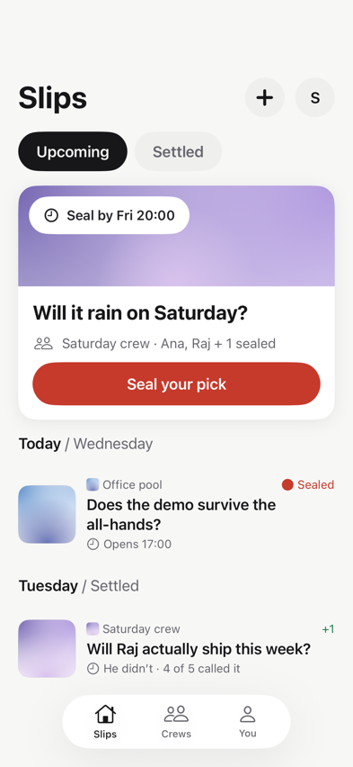
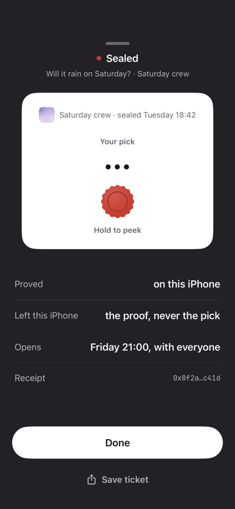
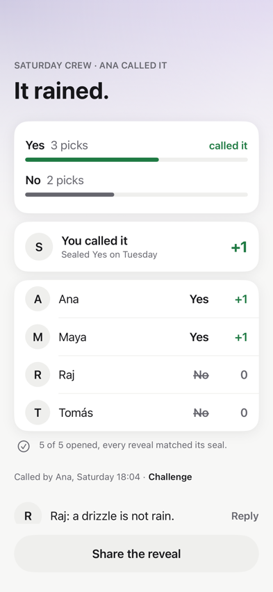

# Slip

Sealed predictions with friends. Pick a side, keep it hidden, then prove that your opening matches your seal.

Slip is an iOS pre-alpha for the AkinDo Buildathon, Wave 1 (2026-09-16). By default, the app runs an **offline, single-player local round** with real Compact execution and native proof generation. Experimental undeployed-network components can also assemble and prove `sealPick` on device for handoff to a trusted developer relay. Connected crews are not shipped, and an authenticated physical-iPhone → relay → devnet run has not yet been demonstrated.

Built on [Midnight](https://docs.midnight.network) and [Compact](https://docs.midnight.network/compact), using the `midnightntwrk` cryptography and ledger libraries through **MidnightKit**, our Swift/Rust layer.

<table>
  <tr>
    <td></td>
    <td></td>
    <td></td>
  </tr>
  <tr>
    <td align="center">seal on your phone</td>
    <td align="center">the proof travels, never the pick</td>
    <td align="center">opened together, called later</td>
  </tr>
</table>

Design previews of the intended crew flow. The sealed witness stays on device; a verified opening deliberately publishes the choice. For the current working loop and its evidence boundaries, use the [three-minute demo runbook](docs/demo.md).

## Try the local round

1. Create a question with two sides and hold to seal a pick. Enrollment, creation and sealing are proved locally.
2. Open the local sample. This explicitly advances a sample clock to the opening window; it does not change the device clock or open a shared round early.
3. Call the outcome after the sample's opening window. Reveal, settlement and an optional challenge each execute the existing circuit and produce a native proof.
4. See the public opening, outcome, local score and per-step timings. A challenge voids the outcome; the original opening remains intact.

The actor retains the original device secret and pick only in memory. The circuit re-derives the same salt for reveal and rejects a flipped pick. Before opening, the pick is hidden by its commitment. On reveal the choice is deliberately public; the secret and derived salt stay local. There is no remote proving fallback, analytics or persistence. **Terminating the app loses this local session.** A proof of a matching opening is not a claim that nobody saw the unlocked phone.

## Native proof and network evidence

`ContractRuntime` executes compiler-generated JavaScript under JavaScriptCore. `Prover.prove(circuit:proofData:)` converts the private runtime transcript to a preimage in memory and generates the proof natively. Runtime input is never written out by the app.

Physical-device run (2026-09-05, iPhone 15 Pro / A17 Pro, iOS 26.6.1, this app build): the sealing and round-flow suites pass on the phone (13 tests, 2 suites) and the complete local lifecycle proves all six circuits with real, round-bound proofs (3 tests). Earlier standalone benchmark (2026-09-03, same phone): `sealPick` key load **24 ms**, prove **1,776 ms**, **4,480 bytes**, peak RSS **290 MB** — see [MidnightKit measurements](.claude/docs/midnightkit.md).

Current app gate (2026-09-06, iPhone 17 Pro simulator / iOS 27): **45 tests passed**, including six real-circuit proving cases, the complete lifecycle, circuit-level mismatch rejection followed by recovery, and the network-component boundary. One complete-round run on 2026-09-05 measured:

| Circuit | Prepare / replay | Key load | Prove | Proof bytes |
|---|---:|---:|---:|---:|
| `enrollMember` | 16.9 ms | 14 ms | 466 ms | 4,480 |
| `createSlip` | 23.3 ms | 14 ms | 471 ms | 4,480 |
| `sealPick` | 26.9 ms | 27 ms | 827 ms | 4,480 |
| `reveal` | 29.1 ms | 28 ms | 1,073 ms | 4,480 |
| `settle` | 30.7 ms | 14 ms | 820 ms | 4,480 |
| `dispute` | 33.6 ms | 14 ms | 584 ms | 4,480 |

Same lifecycle on the physical iPhone 15 Pro (iOS 26.6.1), one run, `LocalRoundServiceTests` on device:

| Circuit | Execute | Key load | Prove | Proof bytes |
|---|---|---|---|---|
| `enrollMember` | 15.6 ms | 13 ms | 777 ms | 4,480 |
| `createSlip` | 22.2 ms | 13 ms | 779 ms | 4,480 |
| `sealPick` | 28.4 ms | 26 ms | 1,493 ms | 4,480 |
| `reveal` | 27.9 ms | 26 ms | 1,845 ms | 4,480 |
| `settle` | 34.5 ms | 13 ms | 1,046 ms | 4,480 |
| `dispute` | 38.9 ms | 16 ms | 1,016 ms | 4,480 |

Physical-device component run (`NetworkSealingServiceTests`, iPhone 15 Pro, stub relay): `sealPick` executed against an embedded post-create contract state in **9 ms**, then assembled and proved in process in **1,641 ms**, producing a **5,238-byte** proved/pre-binding transaction. The planted device-secret pattern was absent from the handed-off bytes. The stub only acknowledged submit and confirm; this run had no HTTP relay, steward wallet, node or indexer.

Authenticated host relay demo (2026-09-05): a fresh local contract was deployed and prepared, Slip's native prover assembled the 5,238-byte `sealPick` transaction in **1,107 ms**, and the proved/pre-binding bytes crossed the bearer-authenticated steward relay. The node returned `SucceedEntirely` at block 2128; relay confirmation and an independent indexer read both found the exact expected commitment. This establishes the host producer → authenticated relay → local devnet path, not physical-iPhone provenance. The tooling proof service handled setup calls and the wallet's separate DUST balancing transaction; Slip's `sealPick` proof came from the native prover. See [Phase 6 sources](docs/phase6-sources.md) and [Phase 7 sources](docs/phase7-sources.md).

Both tables are single-run observations (host CPU, then the phone), not latency promises or a performance budget. Preparation includes runtime initialization and replay of accepted steps; key/prove durations come from `Proof`. Reproduce the public-only `LOCAL_ROUND_PROOF` measurements with `LocalRoundServiceTests`. Local execution/proving does **not** establish network acceptance. Source decisions and version caveats: [Phase 4 sources](docs/phase4-sources.md).

## Build and test

Swift 6/SwiftUI, an iOS 17 deployment target, and Liquid Glass where available. Current verification uses Xcode 27 beta with the iPhone 17 Pro iOS 27 simulator, plus a physical iPhone 15 Pro on iOS 26.6.1 for the proving suites (above). iOS 17 runtime behavior and archive compatibility are still unverified; the deployment setting alone is not compatibility evidence.

Prerequisites: Xcode, XcodeGen 2.45+, Compact compiler **0.31.1** (language **0.23.0**, runtime **0.16.0**, ledger **8**), Node/npm, generated contract artifacts, and the matching simulator native archive. No network services are needed to run the local app.

**Fresh-clone limitation:** the native archive and its external Rust source are not distributed by this repository yet. `MidnightKit/Vendor/libslip_prove_ffi.a` and generated `contracts/build/` artifacts are ignored. Obtain the matching build inputs from the maintainer; CI's missing-archive warning/skip is not a passing MidnightKit test.

With the build inputs available:

```sh
sh scripts/install-hooks.sh
# Only if the simulator archive is missing, with the external prover source available:
# sh scripts/sync-prover.sh aarch64-apple-ios-sim

# On a fresh checkout, generate contracts/build using the pinned compiler:
cd contracts
npm ci
npm run build
node test/link-build.mjs
cd ..

# Existing official public parameter files, not a server or witness export:
sh scripts/prepare-app-params.sh /path/to/existing/params
xcodegen generate
xcodebuild -scheme Slip -destination 'platform=iOS Simulator,name=iPhone 17 Pro' test
scripts/design-gate.sh Slip/
cd MidnightKit
xcodebuild test -scheme MidnightKit -destination 'platform=iOS Simulator,name=iPhone 17 Pro'
```

Parameter staging checks the official k13/k14 SHA-256 values and has no download fallback. Open the generated `Slip.xcodeproj`, choose Slip and a simulator, then Run. Repository signing uses personal team `L594CGSH6A`; contributors must use their own authorized signing configuration for any later device work.

To reproduce the host relay component after the generated artifacts, e2e dependencies,
native CLI and local Docker services are available:

```sh
(cd contracts && npm run devnet:up)
(cd contracts/e2e && npm ci)
node --test scripts/steward-relay.test.mjs
node scripts/phase7-live-relay-demo.mjs
```

The self-contained demo creates its bearer token internally and never prints it; the
operator-only serve mode instead prints a one-time setup token to its trusted local
terminal. The demo uses the proof service for contract setup and the wallet's separate
DUST proof, never for Slip's native `sealPick` proof. Set `SLIP_PROVE_CLI` only when the
native CLI is not at the documented default path. This host component test is not a
substitute for an authenticated physical-device run.

## Design and documentation

The [30 canonical v6 boards](docs/design/v6/) are losslessly compacted copies of the reviewed app snapshots, produced on 2026-09-05 after the Luma pass. They cover 24 routes plus three dark and three AX1 boards; v5 Paper boards are historical. Snapshot tests use serialized key-window rendering, 1× standard-range PNGs, light/dark, XL, AX1 and AX5. The 120 references total **11,191,164 bytes** after pixel-identical lossless compression; the comparison threshold remains **0.012**. Re-recording is explicit; see [testing](.claude/docs/testing.md).

The [interactive explainer](docs/how-slip-works.html) distinguishes the current local build from the planned connected flow. It is an illustration, not a transaction receipt.

Start with [CONTRIBUTING.md](CONTRIBUTING.md) for development and verification requirements, and [SECURITY.md](SECURITY.md) for the privacy invariant and private vulnerability reporting. [AGENTS.md](AGENTS.md) maps the repository and its deeper references. Midnight-specific work requires kapa, Midnight Expert and MIDSKILLS, plus compiler/test verification. Commits must include their source and gate evidence. Private owner handoffs are intentionally not published.

## License

Apache-2.0
