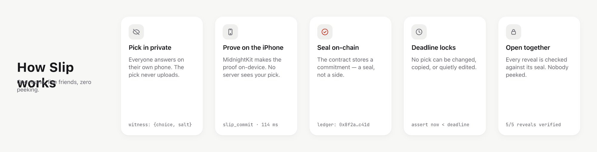

# Slip

**Sealed group predictions with friends. Nobody can peek — provably.**

Every pick'em app promises your friends can't see your pick until lockout. That promise is enforced by an operator's server you have to trust. Slip is the version where nobody *can* peek: your pick is sealed cryptographically **on your own iPhone**, the chain notarizes only a commitment, and when the deadline hits, everyone's picks open together — each one checked against its seal. No server ever sees a side. Not even ours, because there isn't one.

## How a round works

1. **Create a slip** — a question, two sides, a reveal time, your crew.
2. **Seal your pick** — choose privately; your phone generates a zero-knowledge proof and posts only a commitment. Hold to seal.
3. **The quiet wait** — see who's sealed (never *what*), nudge the stragglers, deadline locks the round.
4. **Open together** — all picks reveal simultaneously and verify against their seals. The verdict lands. Winners take points; losers take banter.

## Why this needs a blockchain (for once)

The "nobody peeked, nobody edited" guarantee is a *commitment scheme with a public notary* — exactly what [Midnight](https://docs.midnight.network)'s Compact contracts provide. And unlike the standard flow (which delegates proof generation to a server that sees your private inputs), Slip proves everything **on-device** via **MidnightKit**, our Swift/Rust proving layer — likely the first on-device Midnight prover on iOS.

## Stack

SwiftUI (iOS 17+, Liquid Glass on 26) · MidnightKit (Rust `midnight-zk` cross-compiled to iOS, JavaScriptCore for the Compact runtime) · one Compact smart contract · no backend.

## Status

Pre-alpha, building in the open during Midnight's WaveHack (Wave 1 lands 2026-09-16). The contract, the prover, and the app are landing in that order — watch the commits.

An interactive end-to-end explainer lives at [`docs/how-slip-works.html`](docs/how-slip-works.html); target designs are in [`docs/design/`](docs/design/).

Agents & contributors: start with [AGENTS.md](AGENTS.md); deeper docs live in `.claude/docs/`. After cloning: `sh scripts/install-hooks.sh` wires the pre-push gates.

## License

Apache-2.0
